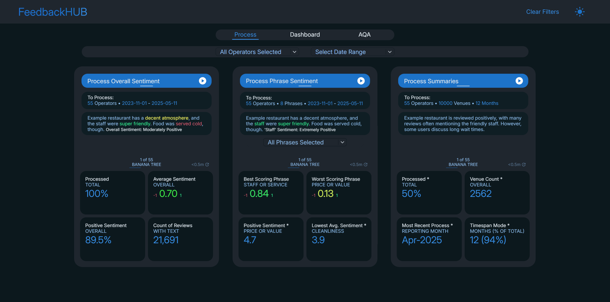
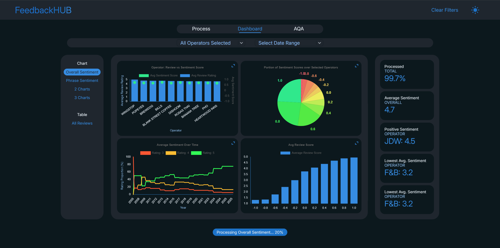

Summarise and analyse the sentiment of Google / Tripadvisor restaurant and pub reviews using OpenAI GPT-4o mini.

Processing             |  Dashboard
:-------------------------:|:-------------------------:
 |  

Show Static Processing Page

Show Static Dashboard Page

Red tables denote those that store sentiment/summarisation info.

